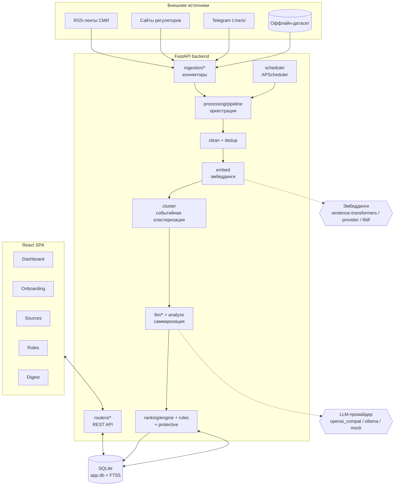
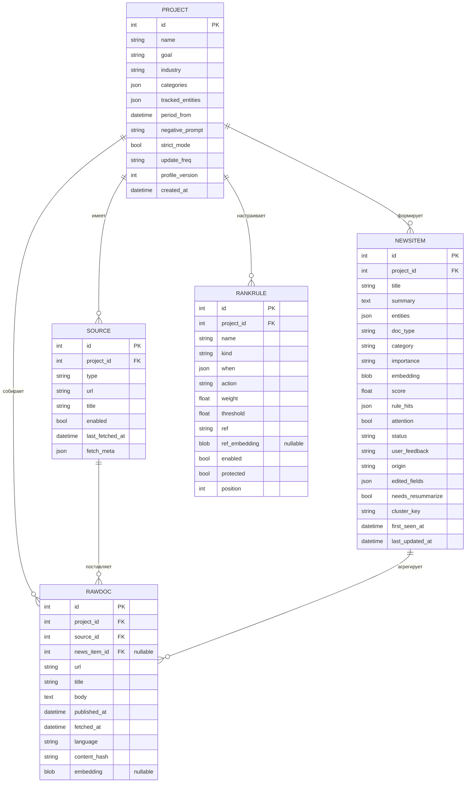
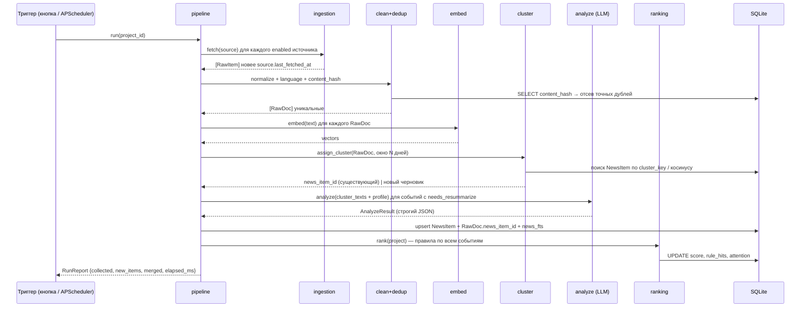

# System Design: Интеллектуальный аналитический центр

> Вводные и журнал решений — в [`REQUIREMENTS.md`](./REQUIREMENTS.md).
> Этот документ доведён до уровня «можно кодить»: контракты, схемы, алгоритмы, пороги.

## Содержание

1. [Обзор архитектуры](#1-обзор-архитектуры)
2. [Технологический стек](#2-технологический-стек)
3. [Модель данных](#3-модель-данных)
4. [Конвейер обработки](#4-конвейер-обработки)
5. [Модуль Ingestion](#5-модуль-ingestion)
6. [Модуль Processing](#6-модуль-processing)
7. [Модуль Ranking](#7-модуль-ranking)
8. [HTTP API](#8-http-api)
9. [Frontend](#9-frontend)
10. [Планировщик](#10-планировщик)
11. [Конфигурация](#11-конфигурация)
12. [Метрики и наблюдаемость](#12-метрики-и-наблюдаемость)
13. [Развёртывание](#13-развёртывание)
14. [Риски и меры](#14-риски-и-меры)
15. [Раздача работы и порядок реализации](#15-раздача-работы-и-порядок-реализации)
16. [Критерии приёмки](#16-критерии-приёмки)

---

## 1. Обзор архитектуры

Монолитный backend (FastAPI) + SPA (React). Единственное хранилище — SQLite. Фоновая обработка —
в том же процессе через APScheduler. LLM и эмбеддинги — за абстракцией провайдера с оффлайн-фолбэком.



Ключевые архитектурные принципы:

- **Разделение «что это» и «насколько это интересно».** LLM отвечает на первое (дорого, редко),
  движок правил — на второе (дёшево, постоянно, без LLM).
- **Событие — единица данных.** Всё, что видит пользователь и на что действуют правила, — это
  `NewsItem`, агрегат первичных документов `RawDoc`.
- **Идемпотентность и инкрементальность.** Повторный запуск конвейера не создаёт дубли и не
  переобрабатывает уже обработанное.
- **Оффлайн-режим — first-class.** `LLM_PROVIDER=mock` + локальные эмбеддинги + датасет `archive`
  дают полный рабочий цикл без сети.

---

## 2. Технологический стек

| Слой | Выбор | Обоснование |
|---|---|---|
| Backend | Python 3.11, FastAPI, Uvicorn | зрелая экосистема парсинга и LLM; async-роуты |
| ORM | SQLAlchemy 2.x | типизированные модели, миграции через Alembic (или `create_all` для прототипа) |
| БД | SQLite + FTS5 | zero-config, полнотекстовый поиск и `bm25()` из коробки |
| Планировщик | APScheduler (in-process) | не нужен отдельный воркер/Redis для прототипа |
| RSS | `feedparser` | стандарт де-факто |
| Извлечение текста | `trafilatura` | лучшее качество на рус. новостях, fallback `selectolax` |
| Telegram | HTTP + `selectolax` парсинг `t.me/s/<channel>` | без авторизации и API-ключей |
| Морфология | `pymorphy3` | лемматизация для regex-правил и TF-IDF-фолбэка |
| Эмбеддинги (default) | `sentence-transformers`, `intfloat/multilingual-e5-small` | ~120 МБ, CPU, рус+англ, без ключа |
| LLM | абстракция: OpenAI-совместимый / Ollama / mock | провайдер выбирается по ENV |
| Frontend | React 18, Vite, TypeScript | быстрый старт, знакомо команде |
| UI-kit | Mantine (или shadcn/ui) | готовые таблицы, формы, drawer, бейджи |
| HTTP-клиент | TanStack Query + fetch | кэш, инвалидация, состояние загрузки |
| Контейнеризация | Docker + docker-compose | один `up` для демо |

Зависимости backend (`requirements.txt`, ориентир):
`fastapi uvicorn[standard] sqlalchemy pydantic feedparser trafilatura selectolax httpx
pymorphy3 scikit-learn sentence-transformers apscheduler python-multipart`.

---

## 3. Модель данных

### 3.1. ER-диаграмма



### 3.2. Перечисления

| Поле | Значения |
|---|---|
| `Source.type` | `rss` \| `html_site` \| `telegram_web` \| `archive` \| `manual` |
| `Project.update_freq` | `hourly` \| `few_daily` \| `daily` \| `manual` |
| `NewsItem.doc_type` | `npa` \| `news` |
| `NewsItem.category` | `регуляторика` \| `репутация` \| `конкуренты` \| `тренды` |
| `NewsItem.importance` | `high` \| `medium` \| `low` |
| `NewsItem.status` | `active` \| `hidden` |
| `NewsItem.user_feedback` | `useful` \| `irrelevant` \| `null` |
| `NewsItem.origin` | `collected` \| `manual` |
| `RankRule.kind` | `field` \| `semantic` |
| `RankRule.action` | `boost` \| `penalize` \| `pin` \| `hide` |

### 3.3. Эскиз DDL и индексы

```sql
CREATE TABLE source (
  id INTEGER PRIMARY KEY,
  project_id INTEGER NOT NULL REFERENCES project(id) ON DELETE CASCADE,
  type TEXT NOT NULL,
  url TEXT,
  title TEXT,
  enabled INTEGER NOT NULL DEFAULT 1,
  last_fetched_at TEXT,
  fetch_meta TEXT DEFAULT '{}'
);
CREATE INDEX ix_source_project ON source(project_id, enabled);

CREATE TABLE raw_doc (
  id INTEGER PRIMARY KEY,
  project_id INTEGER NOT NULL REFERENCES project(id) ON DELETE CASCADE,
  source_id INTEGER NOT NULL REFERENCES source(id) ON DELETE CASCADE,
  news_item_id INTEGER REFERENCES news_item(id) ON DELETE SET NULL,
  url TEXT, title TEXT, body TEXT,
  published_at TEXT, fetched_at TEXT NOT NULL,
  language TEXT, content_hash TEXT NOT NULL,
  embedding BLOB
);
CREATE UNIQUE INDEX ux_rawdoc_hash ON raw_doc(project_id, content_hash);
CREATE INDEX ix_rawdoc_newsitem ON raw_doc(news_item_id);
CREATE INDEX ix_rawdoc_published ON raw_doc(project_id, published_at);

CREATE TABLE news_item (
  id INTEGER PRIMARY KEY,
  project_id INTEGER NOT NULL REFERENCES project(id) ON DELETE CASCADE,
  title TEXT, summary TEXT, entities TEXT DEFAULT '{}',
  doc_type TEXT, category TEXT, importance TEXT,
  embedding BLOB,
  score REAL DEFAULT 0, rule_hits TEXT DEFAULT '[]',
  attention INTEGER DEFAULT 0, status TEXT DEFAULT 'active',
  user_feedback TEXT, origin TEXT DEFAULT 'collected',
  edited_fields TEXT DEFAULT '[]', needs_resummarize INTEGER DEFAULT 0,
  cluster_key TEXT,
  first_seen_at TEXT NOT NULL, last_updated_at TEXT NOT NULL
);
CREATE INDEX ix_newsitem_feed ON news_item(project_id, status, score DESC);
CREATE INDEX ix_newsitem_cluster ON news_item(project_id, cluster_key);

CREATE TABLE rank_rule (
  id INTEGER PRIMARY KEY,
  project_id INTEGER NOT NULL REFERENCES project(id) ON DELETE CASCADE,
  name TEXT NOT NULL, kind TEXT NOT NULL DEFAULT 'field',
  "when" TEXT DEFAULT '[]', action TEXT NOT NULL, weight REAL DEFAULT 0,
  threshold REAL, ref TEXT, ref_embedding BLOB,
  enabled INTEGER NOT NULL DEFAULT 1, protected INTEGER NOT NULL DEFAULT 0,
  position INTEGER DEFAULT 0
);
CREATE INDEX ix_rule_project ON rank_rule(project_id, enabled);

-- Полнотекстовый поиск: contentless FTS5, синхронизация триггерами
CREATE VIRTUAL TABLE news_fts USING fts5(
  title, summary, entity_names, body_concat,
  content='news_item', content_rowid='id', tokenize='unicode61 remove_diacritics 2'
);
```

`entity_names` = плоская строка из `entities.who` + `entities.what`; `body_concat` = склейка
`body` всех `RawDoc` события (для поиска по исходному тексту). Триггеры `AFTER INSERT/UPDATE/DELETE`
на `news_item` и `raw_doc` поддерживают `news_fts` в актуальном состоянии.

### 3.4. Правила защиты от перезаписи

При `PATCH /news/{id}` изменённые поля добавляются в `edited_fields`. `analyze.persist()` при
повторной обработке пропускает поля из `edited_fields`. `profile_version` инкрементится при
изменении `industry` / `tracked_entities` — это инвалидирует кэш саммари (см. §6.4).

---

## 4. Конвейер обработки

### 4.1. Последовательность



### 4.2. Этапы

| # | Этап | Модуль | Вход → выход |
|---|---|---|---|
| 1 | Сбор (инкрементальный) | `ingestion/*` | источник → `RawItem[]` новее `last_fetched_at` |
| 2 | Жёсткий отбор | `pipeline` + `dedup` | отсев по периоду, языку, `content_hash` |
| 3 | Очистка | `clean` | HTML → чистый `body`, язык, `content_hash` |
| 4 | Эмбеддинг | `embed` | `body` → вектор (кэшируется на `RawDoc`) |
| 5 | Кластеризация | `cluster` | `RawDoc` → `news_item_id` (существующий/новый) |
| 6 | Саммаризация | `analyze` + `llm/*` | тексты кластера + профиль → `AnalyzeResult` |
| 7 | Персист | `pipeline` | `NewsItem` + `SourceRef` + `news_fts` |
| 8 | Ранжирование | `ranking/engine` | правила → `score`, `rule_hits`, `attention` |

### 4.3. Идемпотентность

- Точные дубли отсекаются `UNIQUE(project_id, content_hash)`.
- Событие не пересаммаризируется, если `needs_resummarize = 0` и `profile_version` не изменился.
- `last_fetched_at` обновляется только после успешного персиста этапа.
- Ранжирование — чистая функция от `(NewsItem, RankRule[])`, безопасно повторять.

---

## 5. Модуль Ingestion

### 5.1. Интерфейс

```python
class RawItem(TypedDict):
    url: str
    title: str
    html: str | None       # исходный HTML/текст
    text: str | None        # уже чистый текст, если источник его даёт
    published_at: datetime | None

class Connector(Protocol):
    type: str
    def fetch(self, source: Source, since: datetime | None) -> Iterable[RawItem]: ...
    def preview(self, url: str) -> list[RawItem]:   # для проверки до сохранения
        ...
```

### 5.2. Реализации

| Коннектор | Как работает | Примечания |
|---|---|---|
| `rss` | `feedparser.parse(url)`; `published_parsed` → `published_at`; тело из `summary`/`content` | самый надёжный; ≥2 источника из MVP закрываются здесь |
| `html_site` | GET страницы листинга → ссылки статей → `trafilatura.extract` по каждой | по домену — свой селектор списка (`config/regulators.py`); начинаем с тех регуляторов, у кого есть RSS (ЦБ РФ) |
| `telegram_web` | GET `https://t.me/s/<channel>` → `selectolax` → `.tgme_widget_message` (текст, дата, ссылка) | без авторизации; пагинация через `?before=<id>` |
| `archive` | чтение `data/dataset/*.json` (или `.md` с фронтматтером) | источник демо; `published_at` из данных |
| `manual` | не поллит; события создаются через `POST /news` | `origin = manual` |

### 5.3. Инкрементальность

`since = source.last_fetched_at` (или `project.period_from` при первом сборе). Коннектор фильтрует
по `published_at > since`; если у источника нет дат — берём всё и полагаемся на `content_hash`.
После успешного прохода: `source.last_fetched_at = max(published_at, now())`.

### 5.4. Пресет источников

`data/seeds/sources.json` — ≥5 источников разных типов для быстрого старта проекта в онбординге
(2 RSS СМИ + 1 сайт регулятора + 1 Telegram + archive). Точный список — открытый вопрос (см.
[`REQUIREMENTS.md` §6](./REQUIREMENTS.md#6-открытые-вопросы)).

---

## 6. Модуль Processing

### 6.1. `clean.py`

- извлечение основного текста: `trafilatura.extract(html, include_comments=False)`;
- нормализация пробелов, удаление буллетов рекламы/подписки (`config/boilerplate.py`);
- язык: `trafilatura`-метаданные или простая эвристика по кириллице;
- `content_hash = sha1(lower(strip(re.sub(r'\W+',' ', text)))[:2000])`.

### 6.2. `dedup.py` (жёсткий уровень)

Точные/технические дубли: совпадение `content_hash` в пределах проекта → `RawItem` отбрасывается
(в лог `RunReport.merged`). Near-duplicate обрабатывается на этапе кластеризации (§6.4).

### 6.3. `embed.py`

```python
class Embedder(Protocol):
    dim: int
    def encode(self, texts: list[str]) -> np.ndarray: ...   # (n, dim), L2-normalized
```

| Провайдер (`EMBED_PROVIDER`) | Реализация |
|---|---|
| `local` (default) | `SentenceTransformer("intfloat/multilingual-e5-small")`, префикс `"query: "` |
| `provider` | `POST {LLM_BASE_URL}/embeddings` OpenAI-совместимо |
| `tfidf` | `TfidfVectorizer(ngram_range=(1,2))` по корпусу проекта + леммы `pymorphy3`; фит при первом вызове, инкрементальный `transform` дальше |

Вектор `RawDoc` кэшируется в `raw_doc.embedding`. Вектор `NewsItem` = среднее векторов его
`RawDoc` **после** саммаризации пересчитывается по `title + summary + entities` и пишется в
`news_item.embedding` (используется semantic-правилами, §7.3).

### 6.4. `cluster.py` (событийная кластеризация)

Цель: сообщения об одном факте из разных источников → один `NewsItem`.

Алгоритм для каждого нового `RawDoc` (в хронологическом порядке):

1. **Кандидаты:** `NewsItem` того же проекта с `first_seen_at` в окне **N = 3 дня** от
   `RawDoc.published_at`.
2. **Быстрый ключ:** `cluster_key = normalize(title)[:64]` — точное совпадение → сразу в кластер.
3. **Семантика:** `sim = max cos(RawDoc.embedding, candidate.centroid)`.
   - `sim ≥ 0.82` → присоединить к кластеру, `news_item.needs_resummarize = 1`;
   - `0.62 ≤ sim < 0.82` → присоединить, если ещё совпадает ≥1 именованная сущность
     (`entities.who`) или ≥3 общих леммы в заголовке;
   - иначе → новый `NewsItem`-черновик (`needs_resummarize = 1`, `cluster_key` от заголовка).
4. `centroid` кластера пересчитывается инкрементально.

Пороги вынесены в конфиг (`CLUSTER_SIM_HIGH`, `CLUSTER_SIM_LOW`, `CLUSTER_WINDOW_DAYS`) —
подбираются на оффлайн-датасете.

### 6.5. `llm/` — провайдер

```python
class LLMProvider(Protocol):
    def complete_json(self, system: str, user: str, schema: dict) -> dict: ...
```

| `LLM_PROVIDER` | Реализация |
|---|---|
| `openai_compat` | `POST {LLM_BASE_URL}/chat/completions`, `response_format={"type":"json_schema",...}`; ретрай с почин­кой JSON |
| `ollama` | `POST {OLLAMA_URL}/api/chat`, `format: "json"` |
| `mock` (default) | без сети: экстрактивное саммари (топ-3 предложения по TF-IDF из объединённого текста кластера) + категоризация/тип/важность по словарям ключевых слов; возвращает валидный `AnalyzeResult` |

### 6.6. `analyze.py` — контракт

**Вход:** профиль проекта (`industry`, `tracked_entities`, `negative_prompt`) + конкатенация
текстов всех `RawDoc` кластера (с маркерами источников).

**System-промпт (суть):** «Ты аналитик отрасли `{industry}`. Особый интерес: `{tracked_entities}`.
Тебе даны сообщения об одном событии из разных источников. Верни ОДНУ непротиворечивую карточку
строго по JSON-схеме, без повторов фактов. Саммари 3–5 предложений, по существу, с фокусом на
последствия для отрасли и указанных компаний.»

**Выход — `AnalyzeResult` (Pydantic, строгая JSON-схема):**

```json
{
  "title": "string",
  "summary": "string (3–5 предложений)",
  "entities": {
    "who": ["string"],
    "what": "string",
    "when": "string (ISO-дата или словесно)",
    "consequences": "string"
  },
  "doc_type": "npa | news",
  "category": "регуляторика | репутация | конкуренты | тренды",
  "importance": "high | medium | low"
}
```

Больше полей нет (см. [`REQUIREMENTS.md` Р5](./REQUIREMENTS.md#р5-минимальный-structured-output-llm)).

**Кэш:** ключ = `sha1(sorted(content_hash кластера) + profile_version)`. Попадание → LLM не
вызывается. Промах или `needs_resummarize=1` → вызов, затем `needs_resummarize=0`.

**Персист:** поля из `edited_fields` события не перезаписываются.

---

## 7. Модуль Ranking

Балл события = **сумма весов сработавших правил проекта**. Без ML, без скрытых факторов.
Пересчёт всей ленты — один проход, `O(события × правила)`, без LLM, < 1 c на сотнях событий.

```python
def rank(item: NewsItem, rules: list[RankRule]) -> tuple[float, list[Hit], bool, bool]:
    score, hits, pinned, hidden = 0.0, [], False, False
    for rule in rules:                       # protected-правила идут первыми
        delta = evaluate(rule, item)          # None если не сработало
        if delta is None:
            continue
        hits.append(Hit(rule.name, rule.action, delta))
        if rule.action == "boost":     score += rule.weight
        elif rule.action == "penalize": score -= rule.weight
        elif rule.action == "pin":      pinned = True
        elif rule.action == "hide":     hidden = True
    if pinned:
        score = max(score, PIN_FLOOR)          # 0.6 по умолчанию
    return score, hits, pinned, hidden
```

### 7.1. Правило `kind: "field"`

```jsonc
{
  "name": "Понижать слухи",
  "kind": "field",
  "when": [ { "field": "summary", "op": "regex", "value": "по слухам|неофициально|источник сообщил" } ],
  "action": "penalize",
  "weight": 3,
  "enabled": true
}
```

**Доступные `field`:** `importance`, `doc_type`, `category`, `entities.who` (list),
`title`, `summary`, `body` (объединённый текст кластера), `source_id` (any of),
`age_days` (число), `source_count` (число).

**Операторы:** `eq`, `ne`, `in`, `contains`, `regex`, `lt`, `gt`.
Текстовые операторы `contains`/`regex` применяются к леммам (`pymorphy3`) и к оригиналу.
`when` — список условий, по умолчанию `AND`; флаг `"any": true` → `OR`.

### 7.2. Стартовый набор правил (создаётся с проектом)

| name | kind | when | action / weight |
|---|---|---|---|
| Важность: высокая | field | `importance == high` | boost / 3 |
| Важность: средняя | field | `importance == medium` | boost / 1 |
| Своя компания в фокусе | field | `entities.who contains <tracked_entity>` | boost / 3 |
| Понижать слухи | field | `summary\|body regex «по слухам\|неофициально\|неподтвержд»` | penalize / 3 |
| Исключить тему ИИ | field | `title\|summary regex «искусственн\|нейросет\|\bИИ\b»` | penalize / 4 |
| Устаревшее ниже | field | `age_days > 7` | penalize / 2 |
| Стоп-темы пользователя | field | `summary\|body contains <леммы из negative_prompt>` | penalize / 3 |

«Исключить тему ИИ» создаётся только если пользователь отметил это в онбординге. Любое правило
удаляется/редактируется.

### 7.3. Правило `kind: "semantic"`

```jsonc
{
  "name": "Близость к теме проекта",
  "kind": "semantic",
  "ref": "субсидии и регулирование экспорта зерна в РФ",
  "action": "boost",
  "weight": 4,
  "threshold": 0.35
}
```

`sim = cos(news_item.embedding, rule.ref_embedding)` (`ref_embedding` считается и сохраняется при
создании/изменении правила; по умолчанию `ref` = строка профиля проекта).

| action | эффект |
|---|---|
| `boost` | `score += weight * sim` |
| `penalize` | `score -= weight * (1 - sim)` |
| `hide` | `sim < threshold` → событие вне ленты |

### 7.4. Защитные правила (`protective.py`)

Инжектятся в начало списка как `protected=1`, недоступны для отключения/удаления через API:

| условие | действие |
|---|---|
| `doc_type == npa` И `body regex «вступает в силу\|штраф\|ответственность\|проверк\|надзор\|суд»` | `pin` |
| `category == репутация` И `body regex «отзыв\|расследован\|иск\|утечк\|бойкот\|претензи»` | `pin` |
| `entities.who` пересекается со списком «НПА на сопровождении» проекта | `pin` |

Пользователь может добавить свои `pin`/`hide`, но не снять `protected`.

### 7.5. Порядок ленты

```
[ Требует внимания ]  = { attention == true }  сортировка: score desc, затем published desc
[ Основная лента ]    = { status == active, не hidden-правилом }  сортировка: score desc,
                          тай-брейк: age asc, затем source_count desc
[ Скрытое ]           доступно по тумблеру: status == hidden ИЛИ спрятано hide-правилом
```

`strict_mode = true`: события с `score < STRICT_THRESHOLD` (0.25) и без `attention` уходят в
«Скрытое». Данные не удаляются никогда.

### 7.6. Временный просмотр

`POST /projects/{id}/news/preview-rank` принимает `rules_override` (полный или добавочный набор) и
возвращает ленту, посчитанную с этими правилами, **ничего не сохраняя**. Используется страницей
Rules (предпросмотр) и полем «показать по смыслу» на дашборде.

---

## 8. HTTP API

Базовый префикс `/api`. Формат ошибок — `{ "detail": "..." }`. Даты — ISO-8601 UTC.

### 8.1. Проекты

| Метод | Путь | Тело / параметры | Ответ |
|---|---|---|---|
| POST | `/projects` | `ProjectCreate` | `Project` (+ стартовые правила) |
| GET | `/projects/{id}` | — | `Project` |
| PATCH | `/projects/{id}` | `ProjectUpdate` | `Project`; при смене `industry`/`tracked_entities` → `profile_version++` |
| POST | `/projects/{id}/collect` | `{ "since": "manual" \| ISO \| null }` | `RunReport` |
| POST | `/projects/{id}/rerank` | — | `{ "updated": n, "elapsed_ms": t }` |
| GET | `/projects/{id}/stats` | — | `Stats` |

```jsonc
// ProjectCreate
{
  "name": "Мониторинг GS Labs",
  "goal": "репутация + регуляторика в АПК",
  "industry": "агропромышленный комплекс",
  "categories": ["регуляторика", "репутация", "конкуренты", "тренды"],
  "tracked_entities": ["GS Labs", "АО ГС"],
  "period_from": "2026-08-27T00:00:00Z",
  "negative_prompt": "не интересуют вакансии и локальные происшествия",
  "exclude_ai_topic": true,
  "strict_mode": false,
  "update_freq": "daily",
  "source_ids_from_seed": [1,2,3,4,5]
}

// RunReport
{
  "collected": 63, "unique": 58, "merged_exact": 5,
  "new_items": 34, "updated_items": 6, "resummarized": 34,
  "llm_calls": 34, "cache_hits": 0, "elapsed_ms": 28740
}

// Stats (для MetricBar)
{
  "raw_docs": 63, "news_items": 34,
  "relevant": 18, "noise_hidden": 12, "attention": 4,
  "last_run": { "elapsed_ms": 28740, "at": "2026-09-03T12:10:00Z" }
}
```

### 8.2. Источники

| Метод | Путь | Тело | Ответ |
|---|---|---|---|
| GET | `/projects/{id}/sources` | — | `Source[]` |
| POST | `/sources` | `SourceCreate` `{project_id,type,url,title?}` | `Source` |
| PATCH | `/sources/{id}` | `{title?,enabled?}` | `Source` |
| DELETE | `/sources/{id}` | — | `204` (события остаются, помечаются `source detached`) |
| POST | `/sources/preview` | `{type,url}` | `RawItem[]` (до 10, без сохранения) |

### 8.3. События (лента)

| Метод | Путь | Параметры / тело | Ответ |
|---|---|---|---|
| GET | `/projects/{id}/news` | `category, importance, doc_type, source_id, date_from, date_to, q, status, section` | `NewsListResponse` |
| GET | `/news/{id}` | — | `NewsItemFull` |
| PATCH | `/news/{id}` | `{title?,summary?,category?,importance?,doc_type?,entities?}` | `NewsItemFull` (поля → `edited_fields`) |
| POST | `/news/{id}/hide` | `{hidden: true\|false}` | `NewsItemFull` |
| POST | `/news/{id}/feedback` | `{value: "useful"\|"irrelevant"\|null}` | `204` |
| POST | `/news` | `NewsManualCreate` | `NewsItemFull` (`origin=manual`) |
| POST | `/projects/{id}/news/preview-rank` | `{rules_override:[Rule], mode:"replace"\|"append"}` | `NewsListResponse` (не сохраняется) |

```jsonc
// NewsListResponse item
{
  "id": 812,
  "title": "ЦБ ужесточил требования к раскрытию для эмитентов АПК",
  "summary": "…",
  "doc_type": "npa",
  "category": "регуляторика",
  "importance": "high",
  "score": 8.4,
  "attention": true,
  "status": "active",
  "published_at": "2026-09-01T09:00:00Z",
  "sources": [
    {"source_id": 3, "title": "ЦБ РФ", "url": "https://cbr.ru/…", "published_at": "…"},
    {"source_id": 7, "title": "TG: Регуляторка", "url": "https://t.me/…", "published_at": "…"}
  ],
  "source_count": 2,
  "rule_hits": [
    {"rule": "Важность: высокая", "action": "boost", "delta": 3},
    {"rule": "Требует внимания: НПА-комплаенс", "action": "pin", "delta": null},
    {"rule": "Близость к теме проекта", "action": "boost", "delta": 2.4}
  ]
}
```

### 8.4. Правила

| Метод | Путь | Тело | Ответ |
|---|---|---|---|
| GET | `/projects/{id}/rules` | — | `Rule[]` (включая `protected`, read-only) |
| POST | `/projects/{id}/rules` | `RuleCreate` | `Rule` + авто-`rerank` |
| PATCH | `/rules/{id}` | `RuleUpdate` | `Rule` + авто-`rerank` (запрет на `protected`) |
| DELETE | `/rules/{id}` | — | `204` + авто-`rerank` (запрет на `protected`) |

### 8.5. Дайджест

| Метод | Путь | Параметры | Ответ |
|---|---|---|---|
| GET | `/projects/{id}/digest` | `period=24h\|7d\|30d\|custom&from&to&format=json\|md` | `Digest` или `text/markdown` |

`Digest`: события за период, сгруппированные по `category`, внутри — по `importance`; каждая
строка = заголовок + саммари + ссылки на источники.

---

## 9. Frontend

### 9.1. Роутинг

| Путь | Страница | Назначение |
|---|---|---|
| `/onboarding` | Onboarding | визард создания проекта (3 шага) |
| `/` | Dashboard | лента событий, фильтры, семантический фокус, метрика |
| `/news/:id` | NewsDrawer (overlay) | карточка события, редактирование, объяснение позиции |
| `/sources` | Sources | CRUD источников + предпросмотр |
| `/rules` | Rules | CRUD правил + предпросмотр эффекта |
| `/digest` | Digest | дайджест за период + экспорт |

### 9.2. Компоненты

| Компонент | Назначение |
|---|---|
| `MetricBar` | `Stats` в виде плашки: собрано → событий → релевантно / шум / внимание / время |
| `SemanticFocus` | поле «показать по смыслу: ___» → `preview-rank` с временным `semantic` `hide` |
| `AttentionBlock` | секция «Требует внимания» над лентой |
| `FeedFilters` | категория, важность, тип, источник, даты, поиск (`q`) |
| `NewsCard` | заголовок, саммари, `ImportanceBadge`, `DocTypeBadge`, `«N источников»`, дата |
| `RuleHits` | список сработавших правил с дельтами — «почему здесь» |
| `SourceList` | все первоисточники события со ссылками |
| `RuleForm` | конструктор правила: `kind` (`field`/`semantic`), условие, действие, вес |
| `SourceForm` | добавление источника с кнопкой «Проверить» (`/sources/preview`) |

### 9.3. Состояние

- Серверное состояние — TanStack Query; инвалидация ключей `news`/`stats` после `collect`,
  `rerank`, `PATCH /news`, любых операций с правилами.
- Локальное состояние фильтров — в URL query params (шарится ссылкой, переживает перезагрузку).
- Семантический фокус — локальный стейт страницы, не сохраняется.

---

## 10. Планировщик

`scheduler.py` на APScheduler (`BackgroundScheduler`, `MemoryJobStore`).

- При старте приложения и при изменении `project.update_freq` — пересоздаётся job проекта:
  `hourly` → каждый час, `few_daily` → каждые 4 часа, `daily` → раз в сутки в 07:00,
  `manual` → job не создаётся.
- Job вызывает `pipeline.run(project_id)` в отдельном потоке; параллельные запуски одного проекта
  сериализуются мьютексом (`per-project lock`).
- Ручной `POST /collect` использует тот же lock — двойной обработки не будет.
- Ошибка сбора одного источника не роняет весь прогон: логируется в `RunReport.errors[]`,
  остальные источники обрабатываются.

---

## 11. Конфигурация

Все параметры — через ENV (`.env`, читается `pydantic-settings`).

| Переменная | Default | Назначение |
|---|---|---|
| `DATABASE_URL` | `sqlite:///data/app.db` | путь к БД |
| `LLM_PROVIDER` | `mock` | `openai_compat` \| `ollama` \| `mock` |
| `LLM_BASE_URL` | — | эндпоинт OpenAI-совместимого API |
| `LLM_API_KEY` | — | ключ (если нужен) |
| `LLM_MODEL` | `gpt-4o-mini` (пример) | имя модели |
| `OLLAMA_URL` | `http://localhost:11434` | для `ollama` |
| `EMBED_PROVIDER` | `local` | `local` \| `provider` \| `tfidf` |
| `EMBED_MODEL` | `intfloat/multilingual-e5-small` | модель sentence-transformers |
| `CLUSTER_SIM_HIGH` | `0.82` | порог безусловного объединения |
| `CLUSTER_SIM_LOW` | `0.62` | порог объединения при совпадении сущности |
| `CLUSTER_WINDOW_DAYS` | `3` | окно поиска кластера |
| `PIN_FLOOR` | `0.6` | пол балла для `pin` |
| `STRICT_THRESHOLD` | `0.25` | порог скрытия в строгом режиме |
| `CORS_ORIGINS` | `http://localhost:5173` | адрес фронта |

---

## 12. Метрики и наблюдаемость

- **`RunReport`** сохраняется после каждого прогона (таблица `run_log`), последний — в `Stats`.
- **Демо-метрика** (`MetricBar`): «собрано N публикаций → M событий за T c; релевантно R;
  скрыто как шум H; требует внимания A». `relevant` = события в основной ленте с `score > 0`;
  `noise_hidden` = скрытые правилами/строгим режимом.
- Логирование: структурные логи этапов пайплайна (`stage`, `count`, `ms`), уровень INFO.
- Health: `GET /api/health` → `{status, db, llm_provider, embed_provider}`.

---

## 13. Развёртывание

```yaml
# docker-compose.yml
services:
  api:
    build: ./backend
    environment:
      - LLM_PROVIDER=${LLM_PROVIDER:-mock}
      - EMBED_PROVIDER=${EMBED_PROVIDER:-local}
      - CORS_ORIGINS=http://localhost:5173
    volumes:
      - ./data:/app/data          # SQLite + датасет + модель эмбеддингов (кэш HF)
    ports: ["8000:8000"]
  web:
    build: ./frontend
    environment:
      - VITE_API_BASE=http://localhost:8000/api
    ports: ["5173:5173"]
```

Локально без Docker: `uvicorn app.main:app --reload` + `npm run dev`. Модель эмбеддингов
скачивается один раз в volume; для полностью оффлайн-демо — заранее прогреть кэш или
`EMBED_PROVIDER=tfidf`.

Первичное наполнение: `python -m app.scripts.import_dataset --project <id>` — загружает
`data/dataset/*` как источник `archive`.

---

## 14. Риски и меры

| Риск | Вероятность | Мера |
|---|---|---|
| Telegram-парсинг ломается / блокируется | средняя | `t.me/s/` без авторизации; фолбэк — RSS-мост; демо не зависит от TG (есть archive) |
| Сайты регуляторов — хрупкий HTML | высокая | начать с ЦБ РФ (есть RSS); селекторы в конфиге; 2 регулятора достаточно для MVP |
| Нет ключа к LLM к дедлайну | средняя | `mock`-провайдер даёт полный рабочий цикл; демо на нём валидно |
| Кластеризация склеивает разные события | средняя | двухпорог + проверка сущностей; пороги калибруются на датасете; ручное «разделить» — стретч |
| Модель эмбеддингов не скачалась на площадке | средняя | `EMBED_PROVIDER=tfidf` как запасной вариант, тот же интерфейс |
| LLM возвращает невалидный JSON | средняя | строгая JSON-схема + ретрай с «почини JSON» + Pydantic-валидация + дефолты |
| Не успеваем весь MVP | средняя | порядок реализации даёт рабочий срез уже после шага 4 (§15) |

---

## 15. Раздача работы и порядок реализации

### Роли (3–5 человек)

| Роль | Зона | Файлы |
|---|---|---|
| **A. Ingestion** | коннекторы, пресет источников, импорт датасета | `ingestion/*`, `data/seeds`, `scripts/import_dataset.py` |
| **B. Processing/LLM** | пайплайн, очистка, дедуп, эмбеддинги, кластеризация, LLM | `processing/*` |
| **C. Ranking/API** | движок правил, protective, все роутеры, FTS, планировщик, stats | `ranking/*`, `routers/*`, `scheduler.py` |
| **D. Frontend** | Onboarding, Dashboard, NewsDrawer, Sources | `web/src/pages`, `web/src/components` |
| **E. Frontend#2 + Demo** | Rules, Digest, MetricBar, семантический фокус, деплой, сценарий | `web/*`, `docker-compose.yml` |

**Контракты фиксируются в первый час:** `AnalyzeResult` (B) и `Rule` + `NewsListResponse` (C) —
кладутся в `schemas.py` и `web/src/api/types.ts`.

### Порядок реализации

1. **Скелет.** FastAPI + модели + SQLite/FTS init + Vite/React каркас + CORS. `GET /projects/{id}/news`
   отдаёт сид-данные, дашборд рендерит ленту.
2. **Оффлайн-цикл.** `archive`-коннектор + `dedup` + `mock`-LLM → события в БД (1 RawDoc = 1 NewsItem).
3. **Кластеризация.** `embed` (local) + `cluster` → дубли из разных источников схлопываются;
   `analyze` переходит на вход «весь кластер».
4. **Правила `field`.** `rules` + `engine` + стартовый набор + `protective` + `RuleHits` на карточке.
   → **После этого шага есть демонстрируемый срез MVP.**
5. **Живые источники.** `rss` + `telegram_web` + 2 регулятора (итого ≥5 источников разных типов).
6. **Управление данными.** CRUD источников и событий, ручное добавление, скрытие, feedback, `edited_fields`.
7. **Онбординг + поиск.** Визард проекта, `FeedFilters`, FTS-поиск.
8. **Страница Rules.** CRUD правил + мгновенный rerank + предпросмотр.
9. **Семантика.** `semantic`-правило + поле «показать по смыслу» (`preview-rank`).
10. **Реальный LLM.** Подключить `openai_compat`/`ollama` через ENV, сравнить с `mock`.
11. **Дайджест, MetricBar, полировка, репетиция демо.**

### Демо-сценарий (защита, ~5 минут)

1. Онбординг: проект «Мониторинг GS Labs», отрасль, отслеживаемые компании, период 7 дней, пресет источников.
2. «Обработать» → `MetricBar`: *собрано 63 → 34 события за ~29 c; релевантно 18; шум 12; внимание 4*.
3. Событие из 3 источников (2 TG + сайт) → одна карточка, 3 ссылки в `SourceList`.
4. Блок «Требует внимания»: критичный НПА, поднятый защитным правилом мимо пользовательских.
5. Карточка: саммари 3–5 предложений в контексте отрасли, сущности, тип «НПА», важность, `RuleHits`.
6. Правим саммари и важность → сохранилось; повторный «Обновить» не перетирает.
7. Добавляем RSS-источник вживую → «Обновить сейчас» → инкрементально приходят только новые события.
8. Добавляем правило «Исключить тему ИИ» (−4) → лента мгновенно пересортировалась, без LLM.
9. «Показать по смыслу»: *«риски новых пошлин для наших поставок»* → лента сжалась до 6 карточек; сброс.
10. Дайджест за неделю → экспорт в Markdown.

---

## 16. Критерии приёмки

Полный список — в [`REQUIREMENTS.md` §4–5](./REQUIREMENTS.md#4-функциональные-требования-сводно).
Технические проверки:

- [ ] `GET /api/health` = 200; `LLM_PROVIDER`, `EMBED_PROVIDER` видны в ответе.
- [ ] `import_dataset` → ≥50 `RawDoc` в БД.
- [ ] `POST /collect` с `LLM_PROVIDER=mock` отрабатывает без сети; у всех `NewsItem` заполнены
      `summary/doc_type/category/importance/score`; `news_items < raw_docs` (кластеризация сработала).
- [ ] 2–3 почти одинаковых текста из разных источников → один `NewsItem` с несколькими `sources`.
- [ ] `GET /news?q=…&importance=high&doc_type=npa` — поиск + фильтры, сортировка по `score`,
      у каждого события заполнен `rule_hits`.
- [ ] `POST /rules` (`penalize -4`, regex по summary) → `GET /news` мгновенно меняет порядок,
      LLM не вызывается; `DELETE` правила возвращает порядок.
- [ ] `POST /news/preview-rank` с временным `semantic` `hide` → лента сокращается; обычный
      `GET /news` — полная лента.
- [ ] `PATCH /news/{id}` меняет саммари; повторный `collect` не перетирает (`edited_fields`).
- [ ] `POST /sources` с реальным RSS + `collect` → приходят только материалы новее `last_fetched_at`.
- [ ] Frontend: дашборд открывается, фильтры/поиск/редактирование работают, блок «Требует внимания»
      и «N источников» отображаются.
- [ ] Полный демо-сценарий укладывается в ~5 минут.
